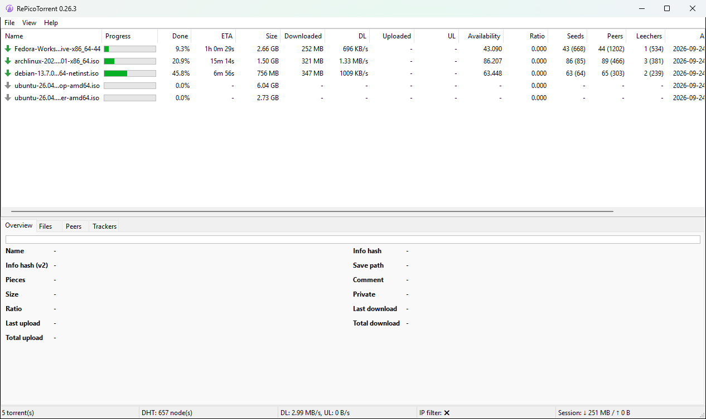

# RePicoTorrent

[](https://github.com/varmtlys/repicotorrent/actions/workflows/build.yml)
[](https://github.com/varmtlys/repicotorrent/releases/latest)

A tiny BitTorrent client for Windows written in modern C++ on
Rasterbar-libtorrent 2.1 and wxWidgets.

RePicoTorrent is a fork of [PicoTorrent](https://github.com/picotorrent/picotorrent),
which is no longer developed. It restarts it on current libraries, fixes
its crashes and data loss, and adds what was missing.

<p align="center">
    
</p>


## Features

- BitTorrent v1, v2 and v1+v2 hybrid torrents ([BEP 52](http://bittorrent.org/beps/bep_0052.html));
  both info hashes of a hybrid torrent are shown.
- DHT with node ID enforcement and privacy lookups (BEP 42, BEP 43), PeX,
  local peer discovery, UPnP, IPv4 and IPv6. WebTorrent is available and
  off by default.
- Torrent list with state icons and separate, sortable columns: size,
  downloaded, download and upload rates, percent done, ratio, and seeds,
  peers and leechers as connected (in swarm).
- Peers tab with country, seed or leecher, and connection flags spelled
  out in words. Files tab with folder totals; double click opens a file.
- Links in torrent comments open in the browser.
- Labels, saved filters and a console that filters the list with queries.
- Light and dark theme.
- **Import from qBittorrent** with progress, trackers, upload and download
  counters, save paths and comments.
- **Portable**: settings and torrents are kept next to the exe.
- **Updates itself** from the GitHub releases; each download is checked
  against the release's SHA-256 checksums.


## Download

Windows 10 or 11. Get the zip for your Windows from
[the latest release](https://github.com/varmtlys/repicotorrent/releases/latest):

| Zip | For |
|---|---|
| `RePicoTorrent-X.Y.Z-x64.zip` | 64-bit Windows |
| `RePicoTorrent-X.Y.Z-arm64.zip` | Windows on ARM (no crash dumps: Crashpad does not support ARM64 yet) |
| `RePicoTorrent-X.Y.Z-x86.zip` | 32-bit Windows |

Unpack it anywhere you can write to and run `RePicoTorrent.exe`. The
Visual C++ runtime is included. `SHA256SUMS.txt` lists the checksums of
the zips.

On every start the program looks for a newer release (also **Help > Check
for update**). **Download and install** fetches the zip for your Windows,
checks it, replaces the program files and restarts; settings and torrents
stay. What changed is in [CHANGELOG.md](CHANGELOG.md).


## Moving from PicoTorrent or qBittorrent

- **PicoTorrent**: **File > Import from PicoTorrent** and pick its
  `PicoTorrent.sqlite` (next to a portable PicoTorrent, or in
  `%LOCALAPPDATA%\PicoTorrent` of an installed one). Torrents and their
  labels are added; the file is only read. To take over everything,
  settings included, copy `PicoTorrent.sqlite` next to `RePicoTorrent.exe`
  before the first start instead: it is renamed to `RePicoTorrent.sqlite`
  and used as is.
- **qBittorrent**: **File > Import from qBittorrent** and pick its
  `BT_backup` folder (`%LOCALAPPDATA%\qBittorrent\BT_backup`). qBittorrent's
  files are only read. Do not seed the same torrents from both clients at
  once.


## Network and privacy

Besides peers, trackers and the DHT, RePicoTorrent connects to:

- `api.github.com` once per start, for the update check;
- `download.db-ip.com` once a month, for the country database of the
  Peers tab (**Preferences > Connection**, GeoIP, to turn it off).

Crash dumps are written to the `Crashpad` folder next to the exe and never
uploaded. WebTorrent, which talks to a public STUN server, is off unless
you enable it.

Trackers and peers see the client as `RePicoTorrent/x.y.z` with peer ID
`-RPxyyz-` (`-RP0262-` for 0.26.2). Private trackers with a client
whitelist may not know it yet.


## Translations

English and Russian are complete. The other languages come from
PicoTorrent and are partly translated; missing strings show in English.
The texts are in [lang](lang), one JSON file per language.


## Building

You need Visual Studio 2022 with the C++ workload (it includes CMake) and
Git. Dependencies come from the vcpkg submodule.

```
git clone --recursive https://github.com/varmtlys/repicotorrent
cd repicotorrent
cmake -S . -B build-x64 -G "Visual Studio 17 2022" -A x64 -DVCPKG_TARGET_TRIPLET=x64-windows-static-md-rel
cmake --build build-x64 --config Release --target PicoTorrent Plugin_Updater PicoTorrent-tests
build-x64\Release\PicoTorrent-tests.exe
```

The program is `build-x64\Release\RePicoTorrent.exe`. For 32-bit use
`-A Win32` and the `x86-windows-static-md-rel` triplet, for ARM64
`-A ARM64` and `arm64-windows-static-md-rel` (built on an ARM64 machine).
The first build compiles the dependencies and takes a while.


## Versions and releases

Versions follow [Semantic Versioning](https://semver.org) and come from
the latest `vX.Y.Z` tag. A build on the tag is that release; a build `N`
commits later is the next patch with a `-dev.N` suffix, for example
`0.26.3-dev.2`. The version is shown in the window title.

To release: add a `## X.Y.Z` section to [CHANGELOG.md](CHANGELOG.md),
commit, then tag and push:

```
git tag vX.Y.Z
git push origin vX.Y.Z
```

The Build workflow compiles x64, x86 and ARM64, runs the tests and
publishes a GitHub release with the zips, symbols, checksums and the
changelog section as notes.


## License

MIT, see [LICENSE](LICENSE).

Copyright (c) 2015 Viktor Elofsson and contributors (PicoTorrent).
Copyright (c) 2026 Ildar Latypov and RePicoTorrent contributors.

The country database is DB-IP Lite by [DB-IP](https://db-ip.com),
licensed under CC BY 4.0.
