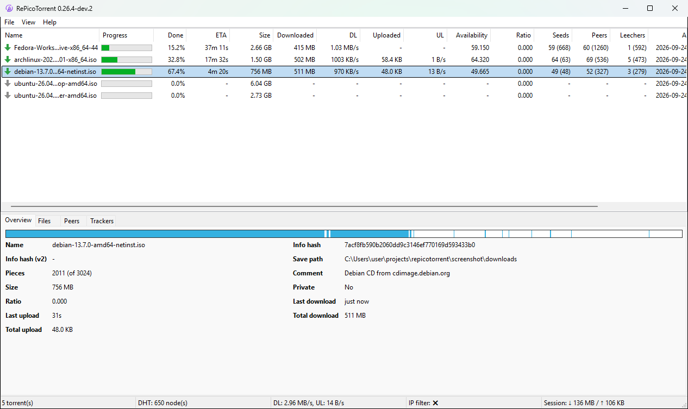
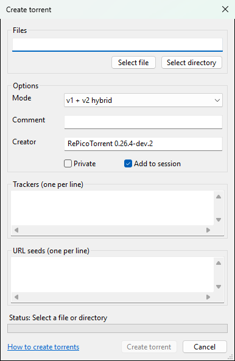
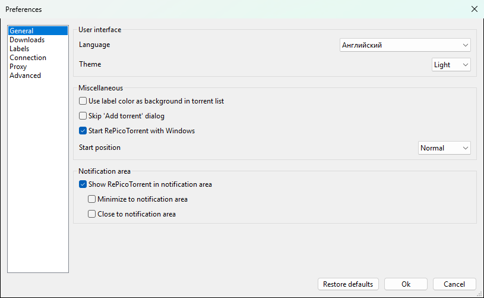
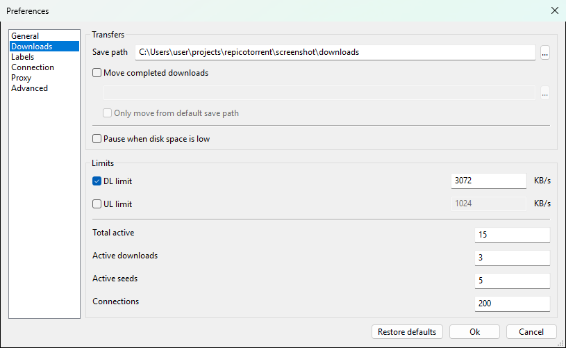
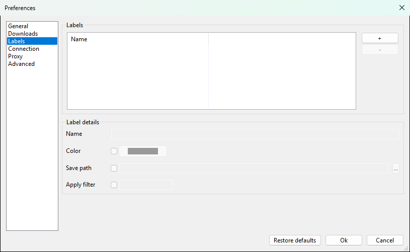
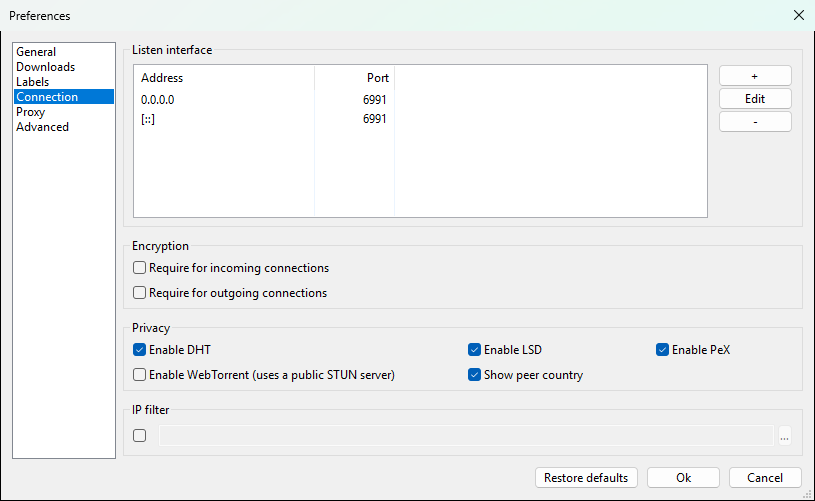
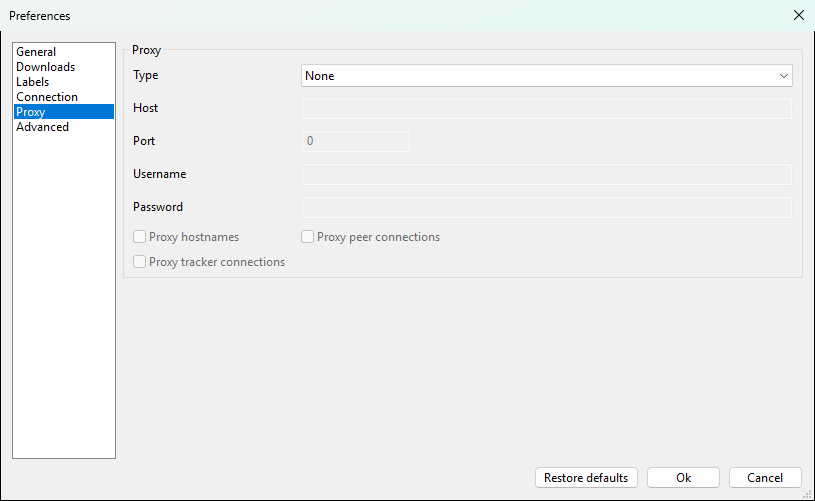
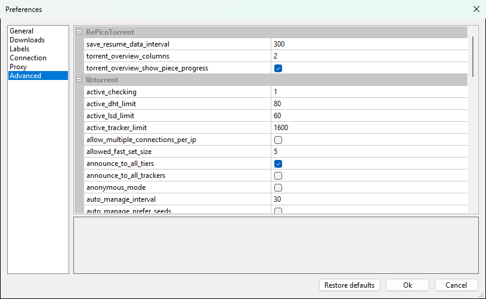

# Documentation de RePicoTorrent

[English](../DOC.md) · [العربية](DOC.ar-SA.md) · [Български](DOC.bg-BG.md) · [Català](DOC.ca-ES.md) · [Čeština](DOC.cs-CZ.md) · [Deutsch](DOC.de-DE.md) · [Ελληνικά](DOC.el-GR.md) · [Español](DOC.es-ES.md) · [Eesti](DOC.et-EE.md) · [Suomi](DOC.fi-FI.md) · **Français** · [עברית](DOC.he-IL.md) · [हिन्दी](DOC.hi-IN.md) · [Hrvatski](DOC.hr-HR.md) · [Magyar](DOC.hu-HU.md) · [Հայերեն](DOC.hy-AM.md) · [Bahasa Indonesia](DOC.id-ID.md) · [Italiano](DOC.it-IT.md) · [日本語](DOC.ja-JP.md) · [ქართული](DOC.ka-GE.md) · [한국어](DOC.ko-KR.md) · [Lietuvių](DOC.lt-LT.md) · [Latviešu](DOC.lv-LV.md) · [Norsk bokmål](DOC.nb-NO.md) · [Nederlands](DOC.nl-NL.md) · [Polski](DOC.pl-PL.md) · [Português (Brasil)](DOC.pt-BR.md) · [Português (Portugal)](DOC.pt-PT.md) · [Română](DOC.ro-RO.md) · [Русский](DOC.ru-RU.md) · [සිංහල](DOC.si-LK.md) · [Slovenčina](DOC.sk-SK.md) · [Srpski](DOC.sr-SP.md) · [Svenska](DOC.sv-SE.md) · [Türkçe](DOC.tr-TR.md) · [Українська](DOC.uk-UA.md) · [Tiếng Việt](DOC.vi-VN.md) · [简体中文](DOC.zh-CN.md) · [繁體中文](DOC.zh-TW.md)

- [Prise en main](#prise-en-main)
- [Fenêtre principale](#fenêtre-principale)
- [Ajouter des torrents](#ajouter-des-torrents)
- [Gérer les torrents](#gérer-les-torrents)
- [Étiquettes](#étiquettes)
- [Filtres et console](#filtres-et-console)
- [Créer des torrents](#créer-des-torrents)
- [Préférences](#préférences)
- [Passer de PicoTorrent ou qBittorrent](#passer-de-picotorrent-ou-qbittorrent)
- [Mises à jour](#mises-à-jour)
- [Raccourcis clavier](#raccourcis-clavier)
- [Fichiers et ligne de commande](#fichiers-et-ligne-de-commande)


## Prise en main

Téléchargez le zip pour votre Windows depuis la
[page des versions](https://github.com/varmtlys/repicotorrent/releases/latest) :
`x64` pour Windows 64 bits, `arm64` pour Windows sur ARM, `x86` pour Windows
32 bits. Décompressez-le dans n'importe quel dossier accessible en écriture
et lancez `RePicoTorrent.exe`. Rien n'est installé : les réglages, la liste
des torrents et les journaux sont gardés à côté de l'exe, le dossier peut
donc être déplacé ou copié sur une clé USB.

Chaque dossier est une copie distincte du programme. Deux copies dans des
dossiers différents peuvent tourner en même temps si elles utilisent des
ports différents.


## Fenêtre principale



En haut se trouve la liste des torrents. Chaque colonne se trie d'un clic
sur son en-tête ; un clic droit sur les en-têtes affiche ou masque des
colonnes.

- **Progression** et **Done** : la part des données voulues déjà
  téléchargée.
- **Temps Restant**, **Réception**, **Émission** : temps restant, débits de
  téléchargement et d'envoi.
- **Disponibilité** : combien de copies complètes les pairs connectés
  possèdent ensemble.
- **Sources**, **Pairs**, **Leechers** : connectés, et entre
  parenthèses le nombre dans tout l'essaim selon les trackers.

En bas figurent les détails du torrent sélectionné :

- **Aperçu** : nom, empreintes (v1 et v2), taille, dossier,
  commentaire et totaux. Les liens du commentaire s'ouvrent dans le
  navigateur. La barre du haut montre les pièces : chaque pièce téléchargée
  est peinte là où elle se trouve dans le torrent. Les pièces arrivent dans
  le désordre (les plus rares d'abord), donc un torrent en cours a des
  trous.
- **Fichiers** : fichiers et dossiers avec leur progression. Clic droit pour
  fixer une priorité ou ignorer un fichier ; double-clic pour ouvrir un
  fichier téléchargé.
- **Pairs** : pairs connectés avec leur pays, client, débits et
  indicateurs de connexion écrits en toutes lettres.
- **Traqueurs** : état du tracker, sources et leechers qu'il annonce et
  prochaine annonce. Clic droit pour ajouter, retirer ou réannoncer.

La barre d'état affiche le nombre de torrents, les nœuds DHT, les débits
actuels, l'état du filtre IP et le volume transféré pendant la session.
Le menu **Affichage** masque ou affiche le panneau de détails, la barre
d'état et la console.


## Ajouter des torrents

- **Fichier > Ajouter torrent(s)** (Ctrl+O) : choisissez un ou
  plusieurs fichiers `.torrent`.
- **Fichier > Ajouter lien(s) magnet** (Ctrl+U) : collez des liens
  magnet, un par ligne.
- Ouvrez un fichier `.torrent` ou un lien magnet avec `RePicoTorrent.exe` ;
  si le programme de ce dossier tourne déjà, le torrent lui est transmis.

Avant l'ajout, vous pouvez choisir le dossier, les fichiers voulus et une
étiquette. Pour ajouter les torrents directement avec les réglages par
défaut, activez **Ignorer la boîte de dialogue « Ajouter un torrent »** dans les préférences.


## Gérer les torrents

Clic droit sur un ou plusieurs torrents :

- **Reprendre**, **Reprendre (forcer)** (ignore la file), **Interrompre**.
- **Forcer la nouvelle annonce**, **Forcer la revérification** (vérifie les données sur le
  disque).
- **Téléchargement séquentiel** : télécharger les pièces dans l'ordre, pratique
  pour regarder une vidéo pendant son téléchargement.
- **Étiquette** : attribuer une étiquette.
- **Exporter** : lien magnet ou fichier `.torrent`.
- **Déplacer** : déplacer les données vers un autre dossier.
- **Supprimer** : retirer le torrent (Suppr) ou le torrent et ses fichiers
  (Maj+Suppr).
- **En attente** : monter ou descendre dans la file de téléchargement.
- **Copier les informations de hachage**, **Ouvrir dans l'explorateur de fichiers**.


## Étiquettes

Les étiquettes regroupent les torrents. On les crée dans
**Paramètres > Étiquettes** :

- **Couleur** : la couleur de l'étiquette ; avec
  **Utiliser la couleur d'étiquette comme couleur de fond dans la liste des torrents** (**Général**),
  les lignes en sont peintes.
- **Répertoire de sauvegarde** : les torrents ajoutés avec cette étiquette sont
  enregistrés ici.
- **Appliquer filtre** : une expression régulière ; un nouveau torrent dont
  le nom correspond reçoit cette étiquette automatiquement. Exemple :
  `ubuntu|debian|fedora`.

**Affichage > Étiquettes** n'affiche que les torrents d'une étiquette.


## Filtres et console

**Affichage > Filtrer** contient des filtres enregistrés, par
exemple les torrents en cours de téléchargement. **Affichage >
Console** ouvre une ligne sous la liste : tapez une requête et
appuyez sur Entrée pour n'afficher que les torrents correspondants ;
videz-la pour tout réafficher.

| Champ | Type | Sens |
|---|---|---|
| `name` | texte | nom du torrent |
| `label` | texte | nom de l'étiquette |
| `status` | texte | `downloading`, `seeding`, `uploading`, `paused`, `queued`, `error` |
| `progress` | nombre | pourcentage terminé |
| `size` | taille | taille voulue : `b` (par défaut), `kb`, `mb`, `gb` |
| `dl`, `ul` | débit | octets par seconde (par défaut), `kbps`, `mbps`, `gbps` |

Opérateurs : `=`, `<`, `<=`, `>`, `>=` et `~` (contient, sans tenir compte
de la casse), reliés par `and` et `or`. Le texte se met entre guillemets
doubles, les unités s'écrivent en minuscules.

```
name ~ "ubuntu"
size > 1gb and status = "downloading"
progress >= 90 or label = "Linux"
dl > 500kbps
```


## Créer des torrents

**Fichier > Créer un torrent** :



- Choisissez un fichier ou un dossier.
- **Mode** : v1, v2 ou hybride v1 + v2. L'hybride fonctionne avec tous
  les clients et est choisi par défaut.
- **Commentaire** et **Créateur** sont facultatifs.
- **Privé** : les pairs viennent uniquement des trackers, pas du DHT,
  de PeX ni de la découverte locale.
- **Ajouter à la session** : partager le nouveau torrent tout de suite.
- **Traqueur (un par ligne)** : chaque tracker a son propre niveau ; les
  niveaux sont essayés dans l'ordre.
- **URL des sources (une par ligne)** : serveurs web avec les mêmes données.
  Pour un dossier, l'URL doit pointer vers le dossier qui le contient.


## Préférences

**Affichage > Paramètres**. **Rétablir les paramètres par défaut** réinitialise
tous les réglages. Certains changements (langue, thème, ports) demandent un
redémarrage ; le programme le propose.

### Général



- **Langue** et **Theme** (système ou clair ; le thème sombre suit
  le réglage de Windows).
- **Ignorer la boîte de dialogue « Ajouter un torrent »**, **Démarrer RePicoTorrent avec Windows**,
  **Position de démarrage** de la fenêtre.
- **Afficher RePicoTorrent dans la zone de notification**, et si réduire ou fermer la
  fenêtre l'y range.

### Téléchargements



- **Répertoire de sauvegarde**, **Déplacer les téléchargements terminés** vers un autre dossier.
- **Interrompre lorsque l'espace disque est faible**.
- **Limites** : limites de débit en Ko/s, nombre de torrents actifs à la
  fois et nombre total de connexions.

### Étiquettes



Voir [Étiquettes](#étiquettes).

### Connexion



- **Interface d'écoute** : adresses et ports des connexions entrantes.
  `0.0.0.0` et `[::]` signifient toutes les adresses IPv4 et IPv6.
- **Chiffrement** : exiger le chiffrement des connexions entrantes ou
  sortantes.
- **Confidentialité** : DHT, découverte locale (LSD), échange de pairs (PeX),
  WebTorrent et la colonne du pays des pairs. La base des pays (DB-IP
  Lite) est téléchargée une fois par mois tant que la colonne est active.
- **Filtrage IP** : bloquer les adresses d'un filtre au format eMule dans
  un zip, par exemple d'emule-security.org.

### Proxy



Proxy HTTP ou SOCKS4/5, avec ou sans mot de passe, et ce qui passe par lui :
résolution des noms, connexions aux pairs et aux trackers.

### Avancé



Tous les réglages de libtorrent. Sélectionnez-en un pour lire sa
description sous la liste. Ne les modifiez que si vous savez ce qu'ils
font ; **Rétablir les paramètres par défaut** les rétablit.


## Passer de PicoTorrent ou qBittorrent

- **Fichier > Import from PicoTorrent** : choisissez
  `PicoTorrent.sqlite` (à côté d'un PicoTorrent portable, ou dans
  `%LOCALAPPDATA%\PicoTorrent`). Les torrents et leurs étiquettes sont
  ajoutés ; le fichier est seulement lu. Pour tout reprendre, réglages
  compris, copiez `PicoTorrent.sqlite` à côté de `RePicoTorrent.exe` avant
  le premier lancement : il sera renommé en `RePicoTorrent.sqlite`.
- **Fichier > Import from qBittorrent** : choisissez le dossier
  `BT_backup` de qBittorrent (`%LOCALAPPDATA%\qBittorrent\BT_backup`). La
  progression, les trackers, les compteurs, les dossiers et les
  commentaires sont conservés.

Les torrents déjà présents sont ignorés. Ne partagez pas les mêmes torrents
depuis les deux clients à la fois.


## Mises à jour

À chaque lancement, le programme demande à GitHub la dernière version, et
**Aide > Vérifier les mises à jour** le fait à tout moment. S'il existe
une version plus récente, **Download and install** télécharge le zip pour votre
Windows, le vérifie avec les sommes SHA-256 de la version, remplace les
fichiers du programme et redémarre. Réglages et torrents sont conservés.


## Raccourcis clavier

| Touches | Action |
|---|---|
| Ctrl+O | ajouter un torrent |
| Ctrl+U | ajouter des liens magnet |
| Ctrl+A | sélectionner tous les torrents |
| Suppr | retirer les torrents sélectionnés, garder les données |
| Maj+Suppr | retirer les torrents sélectionnés et leurs données |
| F1 | ouvrir cette documentation |


## Fichiers et ligne de commande

À côté de `RePicoTorrent.exe` :

- `RePicoTorrent.sqlite` : réglages, torrents et données de reprise ;
- `coredb.sqlite` : traductions (fait partie du programme) ;
- `logs` : journaux ;
- `Crashpad` : rapports de plantage, jamais envoyés ;
- `dbip-country-lite.mmdb` : la base des pays.

Ligne de commande :

```
RePicoTorrent.exe [--silent] [--save-path=<dossier>] [file.torrent | magnet:?xt=...]...
```

`--silent` ajoute les torrents donnés sans la fenêtre d'ajout,
`--save-path` indique où les enregistrer.
