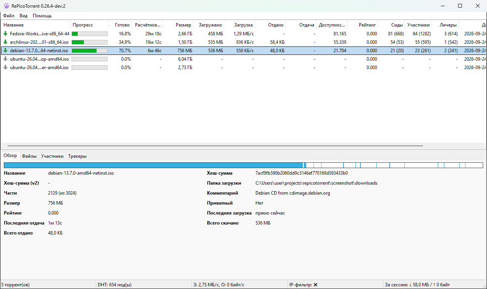
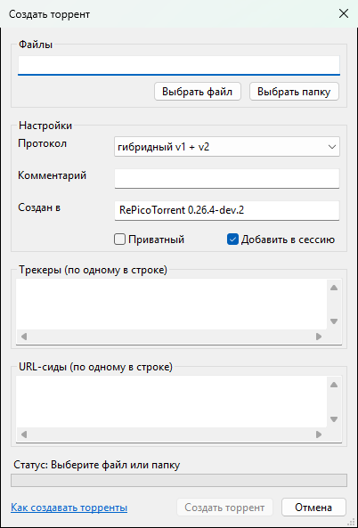
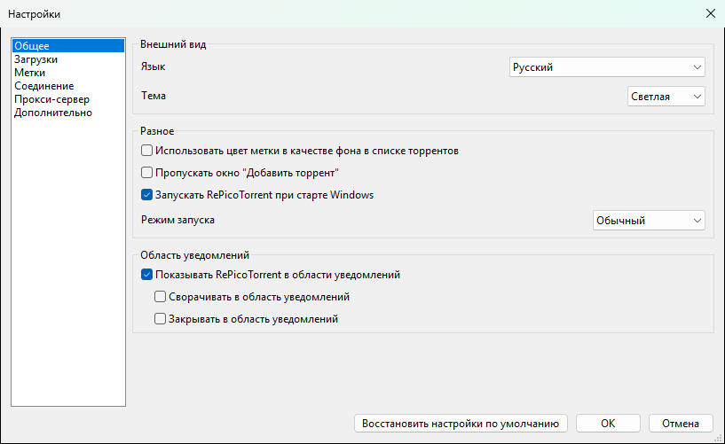
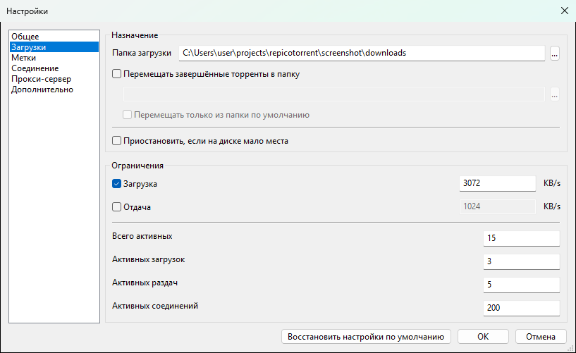
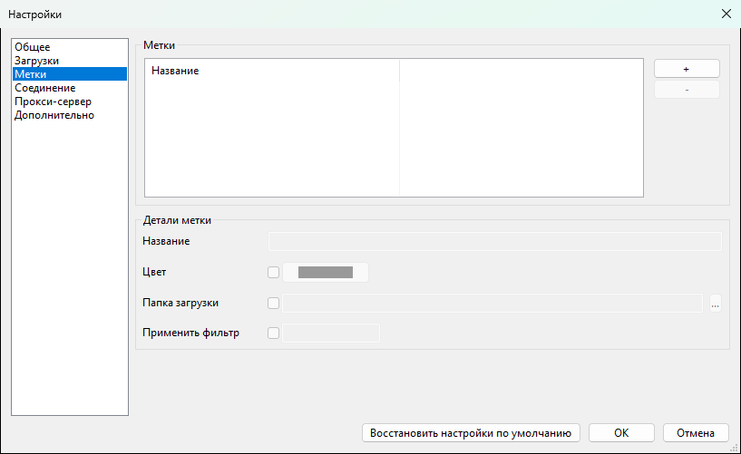
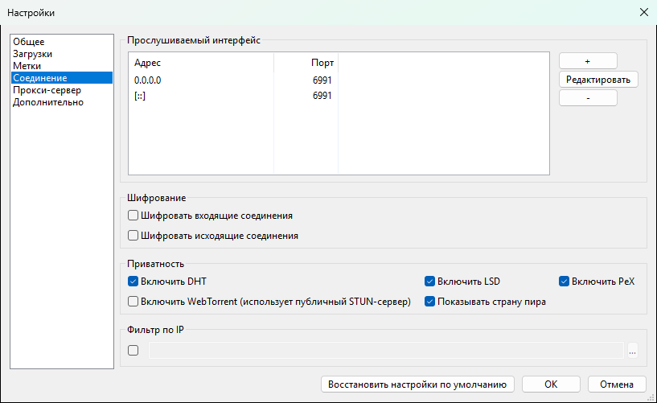
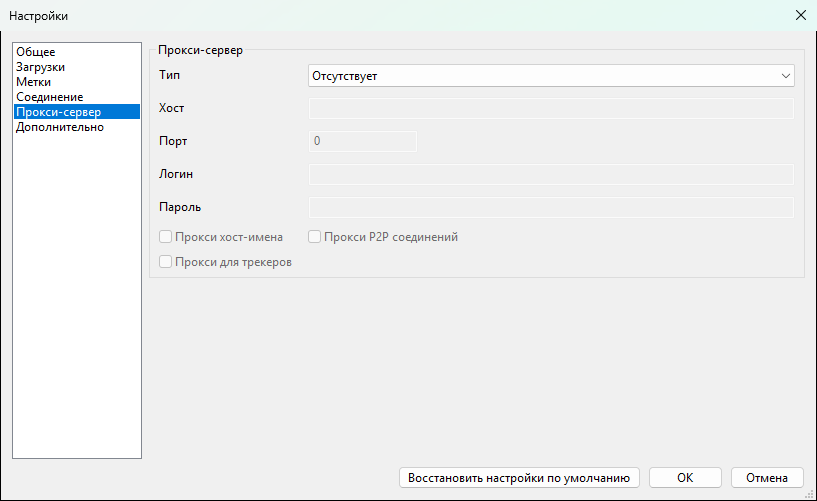
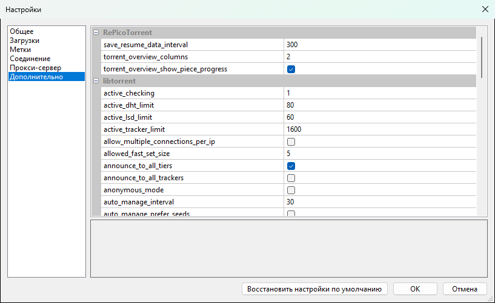

# Документация RePicoTorrent

[English](../DOC.md) · [العربية](DOC.ar-SA.md) · [Български](DOC.bg-BG.md) · [Català](DOC.ca-ES.md) · [Čeština](DOC.cs-CZ.md) · [Deutsch](DOC.de-DE.md) · [Ελληνικά](DOC.el-GR.md) · [Español](DOC.es-ES.md) · [Eesti](DOC.et-EE.md) · [Suomi](DOC.fi-FI.md) · [Français](DOC.fr-FR.md) · [עברית](DOC.he-IL.md) · [हिन्दी](DOC.hi-IN.md) · [Hrvatski](DOC.hr-HR.md) · [Magyar](DOC.hu-HU.md) · [Հայերեն](DOC.hy-AM.md) · [Bahasa Indonesia](DOC.id-ID.md) · [Italiano](DOC.it-IT.md) · [日本語](DOC.ja-JP.md) · [ქართული](DOC.ka-GE.md) · [한국어](DOC.ko-KR.md) · [Lietuvių](DOC.lt-LT.md) · [Latviešu](DOC.lv-LV.md) · [Norsk bokmål](DOC.nb-NO.md) · [Nederlands](DOC.nl-NL.md) · [Polski](DOC.pl-PL.md) · [Português (Brasil)](DOC.pt-BR.md) · [Português (Portugal)](DOC.pt-PT.md) · [Română](DOC.ro-RO.md) · **Русский** · [සිංහල](DOC.si-LK.md) · [Slovenčina](DOC.sk-SK.md) · [Srpski](DOC.sr-SP.md) · [Svenska](DOC.sv-SE.md) · [Türkçe](DOC.tr-TR.md) · [Українська](DOC.uk-UA.md) · [Tiếng Việt](DOC.vi-VN.md) · [简体中文](DOC.zh-CN.md) · [繁體中文](DOC.zh-TW.md)

- [Начало работы](#начало-работы)
- [Главное окно](#главное-окно)
- [Добавление торрентов](#добавление-торрентов)
- [Управление торрентами](#управление-торрентами)
- [Метки](#метки)
- [Фильтры и консоль](#фильтры-и-консоль)
- [Создание торрентов](#создание-торрентов)
- [Настройки](#настройки)
- [Переход с PicoTorrent или qBittorrent](#переход-с-picotorrent-или-qbittorrent)
- [Обновления](#обновления)
- [Горячие клавиши](#горячие-клавиши)
- [Файлы и командная строка](#файлы-и-командная-строка)


## Начало работы

Скачайте zip для своей Windows со
[страницы релизов](https://github.com/varmtlys/repicotorrent/releases/latest):
`x64` для 64-битной Windows, `arm64` для Windows на ARM, `x86` для 32-битной
Windows. Распакуйте его в любую папку, куда у вас есть право записи, и
запустите `RePicoTorrent.exe`. Ничего не устанавливается: настройки, список
торрентов и логи хранятся рядом с exe, поэтому папку можно перенести или
скопировать на флешку.

Каждая папка — отдельная копия программы. Две копии из разных папок могут
работать одновременно, если у них разные порты.


## Главное окно



Вверху список торрентов. Любой столбец сортируется щелчком по заголовку;
правый щелчок по заголовку показывает или скрывает столбцы.

- **Прогресс** и **Готово**: сколько нужных данных уже скачано.
- **Расчётное время**, **Загрузка**, **Отдача**: оставшееся время, скорость загрузки и
  отдачи.
- **Доступность**: сколько полных копий есть у подключённых пиров
  вместе.
- **Сиды**, **Участники**, **Личеры**: подключено, а в скобках —
  сколько их во всём рое по данным трекеров.

Внизу подробности о выбранном торренте:

- **Обзор**: имя, хеш-суммы (v1 и v2), размер, папка загрузки,
  комментарий и итоги. Ссылки в комментарии открываются в браузере. Полоса
  сверху показывает части: каждая скачанная часть закрашена там, где она
  находится в торренте. Части скачиваются не по порядку (сначала редкие),
  поэтому у недокачанного торрента на полосе есть пропуски.
- **Файлы**: файлы и папки с прогрессом. Правый щелчок — приоритет или
  пропуск файла; двойной щелчок открывает скачанный файл.
- **Участники**: подключённые пиры со страной, клиентом, скоростями и
  флагами соединения, расписанными словами.
- **Трекеры**: состояние трекера, число сидов и личеров по его данным и
  время следующего анонса. Правый щелчок — добавить, удалить, обновить.

В строке состояния — число торрентов, узлов DHT, текущие скорости, включён
ли IP-фильтр и сколько передано за сеанс. В меню **Вид** можно
скрыть или показать панель подробностей, строку состояния и консоль.


## Добавление торрентов

- **Файл > Добавить торрент** (Ctrl+O): выберите один или
  несколько файлов `.torrent`.
- **Файл > Добавить magnet-ссылку(и)** (Ctrl+U): вставьте
  magnet-ссылки, по одной в строке.
- Откройте файл `.torrent` или magnet-ссылку с помощью `RePicoTorrent.exe`;
  если программа из этой папки уже запущена, торрент передаётся ей.

Перед добавлением можно выбрать папку, нужные файлы и метку. Чтобы
торренты добавлялись сразу с настройками по умолчанию, включите
**Пропускать окно "Добавить торрент"** в настройках.


## Управление торрентами

Правый щелчок по одному или нескольким торрентам:

- **Возобновить**, **Возобновить (принудительно)** (без учёта очереди), **Приостановить**.
- **Переанонсировать принудительно**, **Проверить принудительно** (проверяет данные на
  диске).
- **Последовательная загрузка**: части скачиваются по порядку — удобно, чтобы
  смотреть видео, пока оно качается.
- **Метка**: назначить метку.
- **Экспортировать**: magnet-ссылка или файл `.torrent`.
- **Переместить**: перенести данные в другую папку.
- **Удалить**: удалить торрент (Del) или торрент вместе с файлами
  (Shift+Del).
- **В очереди**: поднять или опустить в очереди загрузок.
- **Скопировать хеш-сумму**, **Открыть в Проводнике**.


## Метки

Метки группируют торренты. Они создаются в
**Настройки > Метки**:

- **Цвет**: цвет метки; если в разделе **Общее** включено
  **Использовать цвет метки в качестве фона в списке торрентов**, строки
  закрашиваются этим цветом.
- **Папка загрузки**: торренты с этой меткой сохраняются сюда.
- **Применить фильтр**: регулярное выражение; новый торрент, имя которого
  ему соответствует, получает эту метку автоматически. Пример:
  `ubuntu|debian|fedora`.

**Вид > Метки** показывает только торренты с одной меткой.


## Фильтры и консоль

В **Вид > Фильтрация** есть готовые фильтры, например торренты,
которые скачиваются прямо сейчас. **Вид > Консоль**
открывает строку под списком: введите запрос и нажмите Enter, чтобы
оставить только подходящие торренты; очистите строку, чтобы снова показать
все.

| Поле | Тип | Значение |
|---|---|---|
| `name` | текст | имя торрента |
| `label` | текст | имя метки |
| `status` | текст | `downloading`, `seeding`, `uploading`, `paused`, `queued`, `error` |
| `progress` | число | процент готовности |
| `size` | размер | нужный объём: `b` (по умолчанию), `kb`, `mb`, `gb` |
| `dl`, `ul` | скорость | байт в секунду (по умолчанию), `kbps`, `mbps`, `gbps` |

Операторы: `=`, `<`, `<=`, `>`, `>=` и `~` (содержит, без учёта регистра),
соединяются через `and` и `or`. Текст пишется в двойных кавычках, единицы —
строчными буквами.

```
name ~ "ubuntu"
size > 1gb and status = "downloading"
progress >= 90 or label = "Linux"
dl > 500kbps
```


## Создание торрентов

**Файл > Создать торрент**:



- Выберите файл или папку.
- **Протокол**: v1, v2 или гибрид v1 + v2. Гибрид работает со всеми
  клиентами и выбран по умолчанию.
- **Комментарий** и **Создан в** можно не заполнять.
- **Приватный**: пиры берутся только от трекеров, без DHT, PeX и
  локального поиска.
- **Добавить в сессию**: сразу начать раздавать новый торрент.
- **Трекеры (по одному в строке)**: каждый трекер попадает в свой уровень,
  уровни опрашиваются по порядку.
- **URL-сиды (по одному в строке)**: веб-серверы с теми же данными. Для папки
  адрес должен указывать на папку, в которой она лежит.


## Настройки

**Вид > Настройки**. **Восстановить настройки по умолчанию** сбрасывает
все настройки. Некоторые изменения (язык, тема, порты) требуют перезапуска —
программа предложит его сама.

### Общее



- **Язык** и **Тема** (системная или светлая; тёмная тема
  включается вслед за настройкой Windows).
- **Пропускать окно "Добавить торрент"**, **Запускать RePicoTorrent при старте Windows**,
  **Режим запуска** окна.
- **Показывать RePicoTorrent в области уведомлений**, а также сворачивать ли туда
  окно при сворачивании или закрытии.

### Загрузки



- **Папка загрузки**, **Перемещать завершённые торренты в папку** в другую папку.
- **Приостановить, если на диске мало места**.
- **Ограничения**: ограничения скорости загрузки и отдачи в КБ/с, сколько
  торрентов может быть активно одновременно и общее число соединений.

### Метки



См. [Метки](#метки).

### Соединение



- **Прослушиваемый интерфейс**: адреса и порты для входящих соединений.
  `0.0.0.0` и `[::]` означают все адреса IPv4 и IPv6.
- **Шифрование**: требовать шифрование входящих или исходящих
  соединений.
- **Приватность**: DHT, локальный поиск пиров (LSD), обмен пирами (PeX),
  WebTorrent и столбец со страной пира. База стран (DB-IP Lite) скачивается
  раз в месяц, пока этот столбец включён.
- **Фильтр по IP**: блокировать адреса из фильтра в формате eMule, упакованного
  в zip, например с emule-security.org.

### Прокси-сервер



HTTP- или SOCKS4/5-прокси, с паролем или без, и что через него идёт: поиск
имён хостов, соединения с пирами и трекерами.

### Дополнительно



Все настройки libtorrent. Выберите строку, чтобы прочитать её описание под
списком. Меняйте их, только если знаете, что они делают;
**Восстановить настройки по умолчанию** вернёт всё как было.


## Переход с PicoTorrent или qBittorrent

- **Файл > Импорт из PicoTorrent**: выберите
  `PicoTorrent.sqlite` (рядом с портативным PicoTorrent или в
  `%LOCALAPPDATA%\PicoTorrent`). Добавляются торренты и их метки; файл только
  читается. Чтобы перенести всё, включая настройки, скопируйте
  `PicoTorrent.sqlite` рядом с `RePicoTorrent.exe` до первого запуска: он
  будет переименован в `RePicoTorrent.sqlite`.
- **Файл > Импорт из qBittorrent**: выберите папку `BT_backup`
  qBittorrent (`%LOCALAPPDATA%\qBittorrent\BT_backup`). Сохраняются прогресс,
  трекеры, счётчики, папки загрузки и комментарии.

Торренты, которые уже есть в списке, пропускаются. Не раздавайте одни и те
же торренты из двух клиентов одновременно.


## Обновления

При каждом запуске программа спрашивает у GitHub последний релиз, а
**Помощь > Проверить обновления** проверяет в любой момент. Если есть
новая версия, **Скачать и установить** скачивает zip для вашей Windows,
сверяет его с контрольными суммами SHA-256 из релиза, заменяет файлы
программы и перезапускает её. Настройки и торренты остаются.


## Горячие клавиши

| Клавиши | Действие |
|---|---|
| Ctrl+O | добавить торрент |
| Ctrl+U | добавить magnet-ссылки |
| Ctrl+A | выделить все торренты |
| Del | удалить выбранные торренты, оставив данные |
| Shift+Del | удалить выбранные торренты вместе с данными |
| F1 | открыть эту документацию |


## Файлы и командная строка

Рядом с `RePicoTorrent.exe`:

- `RePicoTorrent.sqlite`: настройки, торренты и данные для их продолжения;
- `coredb.sqlite`: переводы (часть программы);
- `logs`: журналы;
- `Crashpad`: дампы падений, никуда не отправляются;
- `dbip-country-lite.mmdb`: база стран.

Командная строка:

```
RePicoTorrent.exe [--silent] [--save-path=<папка>] [file.torrent | magnet:?xt=...]...
```

`--silent` добавляет переданные торренты без окна добавления, `--save-path`
задаёт, куда их сохранять.
